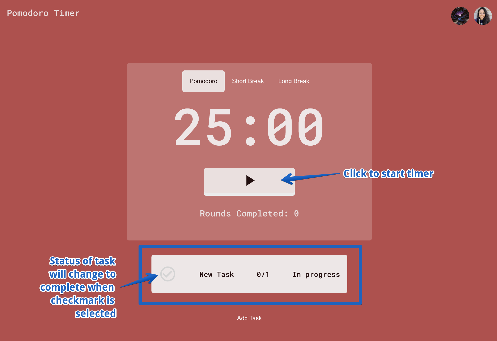
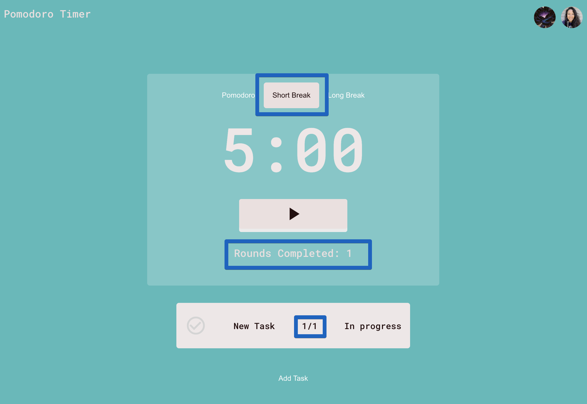

# Pomodoro Clock

## Deployed Link

Click [here](https://missatrox44.github.io/pomodoro-clock/)

## Description

The Pomodoro Technique is a time management method developed by Francesco Cirillo in the late 1980s. The technique uses a timer to break down work into intervals, traditionally 25 minutes in length, separated by short breaks - 5 minutes. Each interval is known as a pomodoro, from the Italian word for tomato, after the tomato-shaped kitchen timer Cirillo used as a university student.

## Table of Contents

- [Pomodoro Facts](#pomodoro-facts)
- [User Story](#user-story)
- [Demo](#demo)
- [Functionality](#functionality)
- [Future Development](#future-development)
- [Contributing](#contributing)
- [Questions](#questions)

## Pomodoro Facts

The original technique has six steps:

1. Decide on the task to be done.
2. Set the pomodoro timer (typically for 25 minutes).
3. Work on the task.
4. End work when the timer rings and take a short break (typically 5–10 minutes).
5. If you have finished fewer than three pomodoros, go back to Step 2 and repeat until you go through all three pomodoros.
6. After three pomodoros are done, take the fourth pomodoro and then take a long break (typically 20 to 30 minutes). Once the long break is finished, return to step 2.
   For the purposes of the technique, a pomodoro is an interval of work time.

Regular breaks are taken, aiding assimilation. A 10-minute break separates consecutive pomodoros. Four pomodoros form a set. There is a longer 20–30 minute break between sets.

A goal of the technique is to reduce the effect of internal and external interruptions on focus and flow. A pomodoro is indivisible; when interrupted during a pomodoro, either the other activity must be recorded and postponed (using the inform – negotiate – schedule – call back strategy) or the pomodoro must be abandoned.

After task completion in a pomodoro, any remaining time should be devoted to activities, for example:

1. Review your work just completed (optional)
2. Review the activities from a learning point of view (ex: What learning objective did you accomplish? What learning outcome did you accomplish? Did you fulfill your learning target, objective, or outcome for the task?)
3. Review the list of upcoming tasks for the next planned pomodoro time blocks, and start reflecting on or updating them.

## User Story

As a developer who wants to be super productive but also get some well deserved brain breaks, I want to create a Pomodoro timer.

- User can see a timer for 25 minutes - working session
- User can see a timer for 5 minutes - short break
- User can see a timer for 15 minutes - long break
- User can start and pause timer
- User hears a sound denoting a session has ended
- User can keep track of tasks they are currently working on

## Demo

## Functionality
The landing page is colored red denoting the timer is set to run a Pomodoro (25 min). The user can click on the avatars in the rop right hand corner and will be redirected to the respected developer's github or portfolio. Clicking the 'Pomodoro Timer' text will redirect users to this repo.

The user can click on the 'Add task' button to add a task. Enter the name of task and estimated Pomodoros it will take to complete the task. Click 'Save' to add task or 'Cancel' to close the modal.

An added task will have a greyed out checkmark denoting the task has not been completed. Actual pomodoro rounds are displayed on the left side of / and estimated is displayed on the right. Click the 'Start' button to start the timer.

After a Pomodoro round has been completed, click the 'Short Break' tab at the top of the timer. The color theme of the app should change and the timer will be reset to 5 min. A running count of pomodoros completed will be displayed as 'Rounds Completed' and will be updated in the current task being tracked. Repeat for three more rounds.

After four rounds have been completed, click the 'Long Break' tab. The color theme of the app should change and the timer will be reset to 15 min.

A task can be marked as completed by clicking the grey checkmark icon. Once completed, the task will no longer be tracked. The user can add another task and repeat the steps above.

NEW FEATURE ALERT: A toggle switch has been added to change the app to run in developer mode. Developer mode counts time the time by 1000% to display functionality of the app. Keep toggle set to default (left) to use the app as intended.

## Future Development
- Reset timer feature
- Edit task feature

## Contributing

This project is a product of paired programming facilitated by [Chingu](https://www.chingu.io/).

[John Pfannkuchen](https://github.com/animatefire)
 
[Sara Baqla](https://github.com/missatrox44)

## Questions

Feel free to contact any contributing developer with suggestions for improvements, questions or concerns.
 
[Email: John Pfannkuchen](mailto:johnpfannkuchen@gmail.com)  
[Email: Sara Baqla](mailto:missatrox44@gmail.com)
